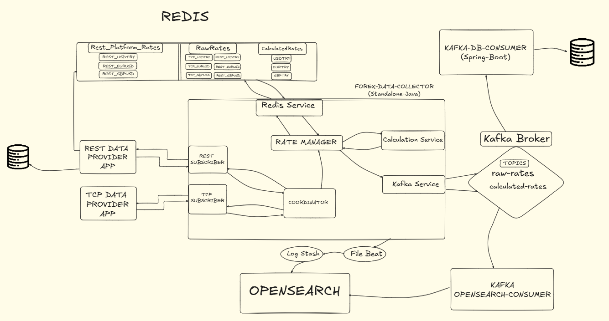

<h1 align="center">Toyota-32bit-Forex-Data-Integration-Project</h1>

  
  
  
  
  

This project aims to develop a comprehensive Java-based software solution for collecting, integrating, evaluating, and calculating financial data from multiple real-time data providers in global financial markets, with a focus on Forex (foreign exchange) data.

## Project Scope

The project includes the following main components:

### Forex Data Simulation Platforms
*   **`tcp-data-provider`**: Simulates streaming Forex data over a TCP socket connection. [See detailed info](./tcp-data-provider/README.md)
*   **`rest-data-provider`**: Simulates Forex data retrieval via a REST API upon request. [Readme file will be here soon.](./rest-data-provider/README.md)

### Forex Data Collector
*   **`forex-data-collector`**: A central **standalone Java application** designed to connect to various data provider platforms (like the simulators above). It collects raw financial data, performs necessary processing and calculations, utilizes Redis for caching, and publishes both raw and calculated data to Kafka topics.

### Kafka Consumers
*   **`kafka-db-consumer`**: Consumes valid raw data and calculated data from Kafka topics and persists them into a database (specific database type TBD or configured separately).
*   **`kafka-opensearch-consumer`**: *Currently not available.*

### Supporting Infrastructure
*   **Redis**: Used as a high-speed cache within the `forex-data-collector` for storing raw and calculated exchange rates temporarily. It also serves as the data repository for the `rest-data-provider` simulator.
*   **Kafka**: Acts as the central messaging backbone, decoupling data producers (like `forex-data-collector`) from data consumers (like `kafka-db-consumer`).

## Project Architecture

  
   
  <em>Diagram illustrating the flow of data between components</em>

## Installation

*   **COMING SOON**