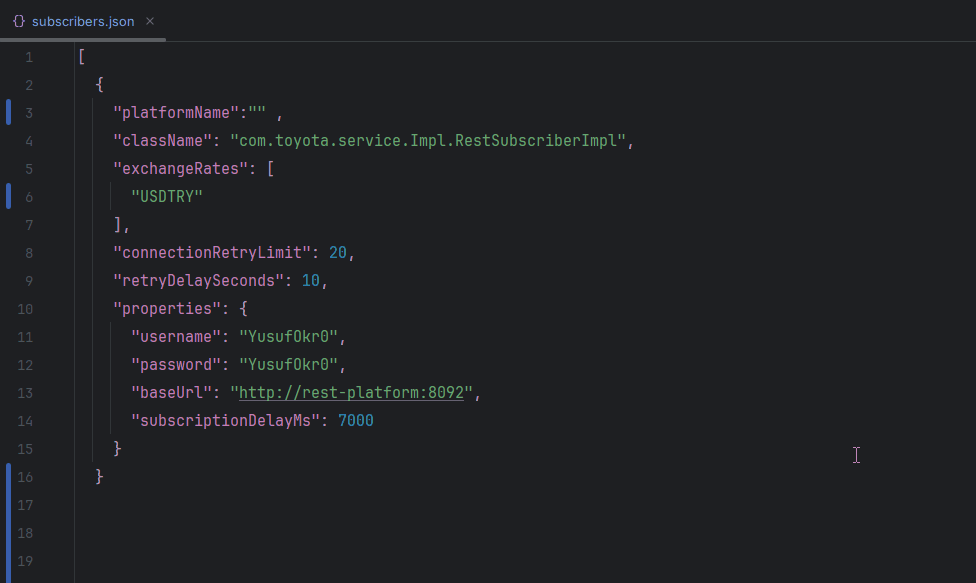

<div align="center" class="text-center">

<br>
<br>
<br>


<h1>TOYOTA-32BIT <br> FOREX-DATA-INTEGRATION-PROJECT</h1>
<p><em>Empowering Real-Time Forex Insights for Smart Decisions</em></p>

<p><em>Built with the tools and technologies:</em></p>


<br>


<br>
<br>

> This project is a Java-based software solution that collects, integrates and processes real-time forex data from global financial markets.
> The aim is to coordinate Forex (foreign exchange market) data in a centralized structure by connecting to the systems of multiple data providers and to perform derivative financial analyses on this data.
> The system primarily targets USD-based currency pairs that dominate global Forex trading (e.g., EUR/USD, GBP/USD).
> By additionally acquiring the USD/TRY rate—treated as a standard input from data providers—it enables seamless derivation of TRY-denominated values for these pairs. This approach allows, for instance, real-time calculation of EUR/TRY by combining EUR/USD with USD/TRY, ensuring accurate cross-rate computations within the Turkish market context.

<br>

</div>

## 📑 Table of Contents

- [Project Components](#project-components)
  - [Forex Data Simulation Platforms](#forex-data-simulation-platforms)
  - [Forex Data Collector](#forex-data-collector)
  - [Kafka Consumers](#kafka-consumers)
  - [Side Technologies](#side-technologies)
- [Project Architecture](#project-architecture)
- [Installation Guide](#installation-guide)
  - [🔸 Quick Start (Using Default Configuration)](#-quick-start-using-default-configuration)
  - [🔸 Start with Custom Settings](#-start-with-custom-settings)
- [How to interact with the simulation](#how-to-interact-with-the-simulation)
  - [🔸 Real-Time Monitoring with Kafka UI](#-real-time-monitoring-with-kafka-ui)
  - [🔸 Persistent Storage with PostgreSQL](#-persistent-storage-with-postgresql)
  - [🔸 Visual Analytics with OpenSearch Dashboards](#-visual-analytics-with-opensearch-dashboards)
- [Contact](#contact)


## Project Components

The project includes the following main components:

### Forex Data Simulation Platforms
*   **`tcp-data-provider`**: Simulates streaming Forex data over a TCP socket connection. [Get More Detail](./tcp-data-provider/README.md)
*   **`rest-data-provider`**: Simulates Forex data retrieval via a REST API upon request. [Readme file will be here soon.](./rest-data-provider/README.md)

### Forex Data Collector
*   **`forex-data-collector`**: A central **standalone Java application** designed to connect to various data provider platforms (like the simulators above). It collects raw financial data, performs necessary processing and calculations, utilizes Redis for caching, and publishes both raw and calculated data to Kafka topics.

### Kafka Consumers
*   **`kafka-db-consumer`**: Consumes valid raw data and calculated data from Kafka topics and persists them into a database.
*   **`kafka-opensearch-consumer`**: A service that listens to raw and calculated currency data from Kafka and saves them to relevant **OpenSearch** indexes.

### Side Technologies

* **`Redis`**: Used as a high-speed cache within the `forex-data-collector` for temporarily storing raw and calculated exchange rates. It also serves as the data repository for the `rest-data-provider` simulator.
* **`Kafka`**: Acts as the central messaging backbone, decoupling data producers (like `forex-data-collector`) from data consumers (like `kafka-db-consumer` and `kafka-opensearch-consumer`).
* **`Filebeat`**: Monitors and ships log files generated by the `forex-data-collector` application to Logstash in real time.
* **`Logstash`**: Processes and transforms logs received from Filebeat before forwarding them to OpenSearch for storage and indexing.
* **`OpenSearch`**: Serves as the centralized search and analytics engine. It stores:
  * Application logs from `forex-data-collector` (via Filebeat -> Logstash -> Opensearch Pipeline),
  * Raw and calculated Forex data consumed and indexed by `kafka-opensearch-consumer`.

## Project Architecture

<div align="center">
  
  <br/>
  <em>Diagram illustrating the flow of data between components</em>
</div>


## Installation Guide


### 🔸 Quick Start (Using Default Configuration)

If you're looking to spin up the entire system quickly **without dealing with any configuration**, I've got you covered :).

Once you pull the project to your local machine from GitHub, simply run the following command:

```bash
docker-compose -f quickstart-compose.yml up -d
```

> This command will automatically pull the required Docker images from Docker Hub and start all necessary containers using the default configuration embedded within the `.jar` files.

---

---

### 🔸 Start with Custom Settings

For users who want **more control** over the simulation behavior, you can start the system using custom configurations.

First, define your desired settings inside the configuration files located in the **`external-config`** directory.

> These files are already **mounted into the relevant containers**, so changes will take effect without additional mapping.

<p align="center"> 
 
<br/> 
<em>External Config Files</em> 
</p>


<br>


You can customize:

* The **exchange rates** each data provider should simulate,
* The **initial and boundary values** of currency rates,
* And the **currencies to which the main app (`forex-data-collector`) should subscribe** on a per-provider basis.


<p align="center"> 
  
  
  <br/> 
  <em> Customizing exchange rates per provider</em> 
  <br>
  <em> Exchange rates must start with the prefixes 'REST' and 'TCP' </em> 
</p>

<br>

<p align="center"> 
 
<br/> 
<em>External subscribers config file</em> 
</p>

<br>

In addition, from the `custom-compose.yml` file, you can configure **the frequency of data publishing**, as well as define:

* **Maximum and minimum fluctuation values** for exchange rates,
* **Simulation speed and intervals**, and
* **Behavior per data provider** individually.


>⚠️ Important: For a meaningful and functional simulation, it is crucial to configure your data providers with USD-based currency pairs (e.g., EUR/USD, GBP/USD), as these form the foundation of the system’s calculation logic—particularly for deriving cross rates such as EUR/TRY.
> To ensure accurate computation of TRY equivalents, the inclusion of the USD/TRY pair in your provider configurations is strictly required.


Once all desired settings are in place, start the system using:

```bash
docker-compose -f custom-compose.yml up -d
```

> **NOTE:** This command will automatically pull all required service images from Docker Hub and start the simulation using your customized configuration.
> In case the images are not available on Docker Hub Docker will instead use the provided Dockerfiles in the project to build the images locally.
> This ensures that the entire simulation environment can run seamlessly either by pulling prebuilt images or by building them from source when needed.

<br>

##  How to interact with the simulation

### 🔸 Real-Time Monitoring with Kafka UI

You can monitor the real-time data flowing through the system using **Kafka UI**. All messages published to Kafka topics such as `raw-rates` and `calculated-rates` can be viewed live.

Kafka UI is accessible at **`http://localhost:8090`** by default. You can arrange it from compose file.

---

### 🔸 Persistent Storage with PostgreSQL

All raw and calculated forex data is also persisted in a **PostgreSQL** database. You can connect to the database directly if you need to query or analyze historical data.
It is available on port **`5433`** by default. You can arrange it from compose file. 
---

### 🔸 Visual Analytics with OpenSearch Dashboards

Forex data is indexed into **OpenSearch**, and you can visualize and analyze this data using **OpenSearch Dashboards**.

It is accessible at **`http://localhost:5601`** by default. You can arrange it from compose file.

Below is an example dashboard panel showing USD/TRY bid and ask prices in real time:

<div align="center">
  
  <br/>
  <em>Live tracking of USD/TRY bid and ask prices via OpenSearch Dashboards</em>
</div>

> The dashboard above is just an example I’ve built to demonstrate the possibilities. To explore the forex data flow yourself, you’ll need to create your own visualizations and bring them together into a dashboard that fits your needs.

## Contact

For any questions, suggestions, or feedback regarding this project, feel free to reach out:


- **Email:** yusufokr0@gmail.com
- **LinkedIn:** [www.linkedin.com/in/yusufokur0](www.linkedin.com/in/yusufokur0)


